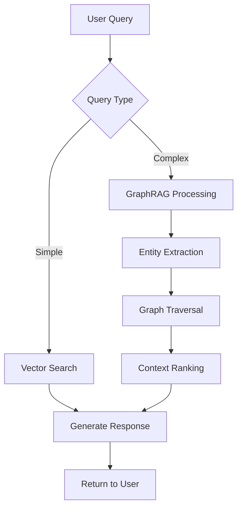

# Usage Guide

This guide provides detailed instructions for using the OpenWebUI AI Assistant Platform's key features and workflows.

## 📋 Table of Contents

- [Getting Started](#getting-started)
- [Model Management](#model-management)
- [Prompt Engineering](#prompt-engineering)
- [Assistant Development](#assistant-development)
- [Knowledge Management](#knowledge-management)
- [Conversation Management](#conversation-management)
- [Analytics and Monitoring](#analytics-and-monitoring)
- [API Usage](#api-usage)
- [Advanced Workflows](#advanced-workflows)

## 🚀 Getting Started

### First Login

1. **Access the Platform**
   ```
   Open your browser and navigate to: http://localhost:3000
   ```

2. **Create Admin Account**
   - Click "Sign Up" on the login page
   - Enter admin credentials:
     - Username: `admin`
     - Email: `admin@yourdomain.com`
     - Password: Choose a secure password
   - Click "Create Account"

3. **Initial Setup**
   - Complete the onboarding wizard
   - Configure your first AI model
   - Set up your profile preferences

### Dashboard Overview

The main dashboard provides access to:

- **Chat Interface**: Central conversation area
- **Model Selector**: Switch between available AI models
- **Sidebar Navigation**: Access to all platform features
- **Settings Panel**: Configuration and preferences
- **Monitoring Widgets**: Real-time system metrics

## 🤖 Model Management

### Adding AI Models

#### OpenAI Models
1. Navigate to **Settings** → **Models**
2. Click **"Add Model"**
3. Fill in the details:
   ```
   Name: GPT-4 Turbo
   Provider: OpenAI
   Base URL: https://api.openai.com/v1
   API Key: sk-your-openai-key-here
   Model ID: gpt-4-1106-preview
   ```
4. Click **"Test Connection"** to verify
5. Click **"Save Model"**

#### Anthropic Claude
```
Name: Claude 3 Sonnet
Provider: Anthropic
Base URL: https://api.anthropic.com
API Key: sk-ant-your-key-here
Model ID: claude-3-sonnet-20240229
```

#### Local Models (LightLLM)
1. **Upload Model Files**
   ```bash
   # Copy model files to the models directory
   cp /path/to/your/model/* ./models/llama2-7b/
   ```

2. **Configure LightLLM**
   ```
   Name: Llama 2 7B (Local)
   Provider: LightLLM
   Base URL: http://lightllm:8000
   Model Path: /models/llama2-7b
   ```

3. **Start Model Server**
   ```bash
   docker-compose restart lightllm
   ```

#### Ollama Models
```bash
# Pull model via Ollama
docker-compose exec ollama ollama pull llama2:7b

# Configure in UI
Name: Llama 2 7B (Ollama)
Provider: Ollama
Base URL: http://ollama:11434
Model ID: llama2:7b
```

### Model Configuration

#### Performance Settings
```json
{
  "temperature": 0.7,
  "max_tokens": 2048,
  "top_p": 0.9,
  "frequency_penalty": 0.0,
  "presence_penalty": 0.0,
  "timeout": 30,
  "retry_attempts": 3
}
```

#### Rate Limiting
```json
{
  "requests_per_minute": 60,
  "tokens_per_minute": 100000,
  "concurrent_requests": 5
}
```

### Model Testing

#### Quick Test
1. Select model from dropdown
2. Type test message: `"Hello, can you introduce yourself?"`
3. Click **Send** or press **Enter**
4. Verify response quality and speed

#### Benchmark Testing
```bash
# Run automated benchmarks
python scripts/benchmark_models.py --models gpt-4,claude-3,llama2-7b
```

## 📝 Prompt Engineering

### Creating Prompt Templates

#### Basic Prompt Template
1. Navigate to **Prompts** → **Templates**
2. Click **"New Template"**
3. Configure the template:
   ```
   Name: Code Review Assistant
   Category: Development
   Description: Reviews code for best practices and issues
   
   Template:
   You are an expert code reviewer. Please review the following code and provide feedback on:
   - Code quality and readability
   - Best practices adherence
   - Potential bugs or issues
   - Performance considerations
   
   Code to review:
   ```{code}```
   
   Please provide constructive feedback and suggestions for improvement.
   ```

4. **Define Parameters**
   ```json
   {
     "code": {
       "type": "text",
       "required": true,
       "description": "Code to be reviewed",
       "placeholder": "Paste your code here..."
     }
   }
   ```

#### Advanced Template with Variables
```
Name: API Documentation Generator
Category: Documentation

Template:
You are a technical writer specializing in API documentation. Create comprehensive documentation for the following API endpoint:

**Endpoint**: {method} {endpoint}
**Purpose**: {purpose}
**Authentication**: {auth_type}

Please include:
1. Endpoint description
2. Request parameters
3. Response format
4. Example requests/responses
5. Error codes and messages

{additional_context}
```

### Prompt Versioning

#### Creating Versions
1. Open existing prompt template
2. Click **"Create Version"**
3. Make modifications to the template
4. Add version notes:
   ```
   Version 2.1: 
   - Added error handling examples
   - Improved response format specification
   - Enhanced context clarity
   ```
5. Save the new version

#### A/B Testing
1. **Set up Test Groups**
   ```json
   {
     "test_name": "code_review_comparison",
     "group_a": {
       "prompt_version": "2.0",
       "weight": 50
     },
     "group_b": {
       "prompt_version": "2.1", 
       "weight": 50
     },
     "success_metrics": ["response_quality", "user_satisfaction"]
   }
   ```

2. **Monitor Results**
   - Navigate to **Analytics** → **Prompt Testing**
   - View performance metrics for each version
   - Statistical significance indicators

### Prompt Categories

#### Organizing Prompts
```
📁 Development
  ├── Code Review
  ├── Bug Analysis  
  ├── Documentation
  └── Testing

📁 Content Creation
  ├── Blog Posts
  ├── Social Media
  ├── Email Templates
  └── Marketing Copy

📁 Analysis
  ├── Data Analysis
  ├── Research Summary
  ├── Report Generation
  └── Comparison Studies
```

## 🤖 Assistant Development

### Creating Specialized Assistants

#### DevOps Assistant
1. Navigate to **Assistants** → **Create New**
2. **Basic Configuration**
   ```
   Name: DevOps Expert
   Description: Kubernetes, Docker, and infrastructure specialist
   Avatar: Select or upload image
   ```

3. **System Prompt**
   ```
   You are a senior DevOps engineer with expertise in:
   - Kubernetes cluster management
   - Docker containerization
   - CI/CD pipeline design
   - Infrastructure as Code (Terraform, Ansible)
   - Monitoring and logging (Prometheus, Grafana, ELK)
   - Cloud platforms (AWS, GCP, Azure)
   
   When helping users:
   1. Ask clarifying questions about their environment
   2. Provide specific, actionable solutions
   3. Include relevant commands and configuration examples
   4. Consider security best practices
   5. Suggest monitoring and alerting approaches
   
   Always prioritize reliability, security, and maintainability in your recommendations.
   ```

4. **Model Configuration**
   ```
   Primary Model: GPT-4 Turbo
   Fallback Model: Claude 3 Sonnet
   Temperature: 0.3
   Max Tokens: 2048
   ```

5. **Tools Integration**
   ```json
   {
     "enabled_tools": [
       "kubectl",
       "docker",
       "terraform",
       "aws_cli",
       "file_browser",
       "code_executor"
     ]
   }
   ```

#### Data Analyst Assistant
```
Name: Data Analyst Pro
Description: Python, SQL, and data visualization expert

System Prompt:
You are an expert data analyst proficient in:
- Python (pandas, numpy, scikit-learn)
- SQL (PostgreSQL, MySQL, BigQuery)
- Data visualization (matplotlib, seaborn, plotly)
- Statistical analysis and machine learning
- Business intelligence and reporting

For each data analysis request:
1. Understand the business question
2. Examine data structure and quality
3. Perform appropriate analysis
4. Create clear visualizations
5. Provide actionable insights
6. Suggest next steps or improvements

Always explain your methodology and assumptions clearly.
```

#### Content Creator Assistant
```
Name: Content Creator
Description: Blog posts, social media, and marketing content

System Prompt:
You are a skilled content creator specializing in:
- Blog post writing and SEO optimization
- Social media content strategy
- Email marketing campaigns
- Technical documentation
- Creative copywriting

For each content request:
1. Understand the target audience
2. Define key messages and objectives
3. Create engaging, relevant content
4. Optimize for appropriate platforms
5. Include calls-to-action when relevant
6. Suggest distribution strategies

Maintain brand voice consistency and focus on value delivery.
```

### Assistant Configuration

#### Advanced Settings
```json
{
  "conversation_memory": {
    "enabled": true,
    "context_length": 4000,
    "memory_type": "sliding_window"
  },
  "knowledge_integration": {
    "enabled": true,
    "collections": ["technical-docs", "company-policies"],
    "similarity_threshold": 0.8
  },
  "response_formatting": {
    "markdown_enabled": true,
    "code_highlighting": true,
    "auto_links": true
  },
  "safety_settings": {
    "content_filter": "moderate",
    "max_response_length": 4096,
    "timeout_seconds": 60
  }
}
```

#### Custom Tools
```python
# Example: Custom tool for the DevOps assistant
@assistant_tool("kubectl_get")
def kubectl_get_resources(resource_type: str, namespace: str = "default") -> str:
    """Get Kubernetes resources of specified type."""
    import subprocess
    
    cmd = f"kubectl get {resource_type} -n {namespace} -o wide"
    result = subprocess.run(cmd.split(), capture_output=True, text=True)
    
    if result.returncode == 0:
        return result.stdout
    else:
        return f"Error: {result.stderr}"

@assistant_tool("analyze_logs")
def analyze_pod_logs(pod_name: str, namespace: str = "default", lines: int = 100) -> str:
    """Analyze recent logs from a Kubernetes pod."""
    import subprocess
    
    cmd = f"kubectl logs {pod_name} -n {namespace} --tail={lines}"
    result = subprocess.run(cmd.split(), capture_output=True, text=True)
    
    # Add basic log analysis
    if result.returncode == 0:
        logs = result.stdout
        error_count = logs.count("ERROR")
        warning_count = logs.count("WARN")
        
        analysis = f"Log Analysis Summary:\n"
        analysis += f"- Total lines: {len(logs.splitlines())}\n"
        analysis += f"- Errors: {error_count}\n"
        analysis += f"- Warnings: {warning_count}\n\n"
        analysis += f"Recent logs:\n{logs}"
        
        return analysis
    else:
        return f"Error retrieving logs: {result.stderr}"
```

### Assistant Deployment

#### Publishing Assistants
1. **Test Thoroughly**
   - Test with various input types
   - Verify tool integrations
   - Check response quality

2. **Deploy to Production**
   ```bash
   # Via API
   curl -X POST http://localhost:3000/api/assistants/deploy \
     -H "Authorization: Bearer $TOKEN" \
     -d '{"assistant_id": "devops-expert", "environment": "production"}'
   ```

3. **Monitor Performance**
   - Track usage metrics
   - Monitor response times
   - Collect user feedback

## 📚 Knowledge Management

### Document Upload and Processing

#### Supported Formats
- **Text Files**: `.txt`, `.md`, `.rst`
- **Documents**: `.pdf`, `.docx`, `.odt`
- **Code Files**: `.py`, `.js`, `.java`, `.cpp`, etc.
- **Data Files**: `.csv`, `.json`, `.xml`, `.yaml`
- **Web Content**: URLs for automatic scraping

#### Upload Process
1. **Navigate to Knowledge Base**
   - Go to **Knowledge** → **Documents**
   - Click **"Upload Documents"**

2. **Select Files**
   ```bash
   # Or upload via API
   curl -X POST http://localhost:3000/api/knowledge/upload \
     -F "files=@document1.pdf" \
     -F "files=@document2.docx" \
     -F "collection=technical-docs" \
     -H "Authorization: Bearer $TOKEN"
   ```

3. **Configure Processing**
   ```json
   {
     "collection_name": "technical-docs",
     "chunk_size": 1000,
     "chunk_overlap": 200,
     "embedding_model": "sentence-transformers/all-MiniLM-L6-v2",
     "enable_graphrag": true,
     "extract_entities": true,
     "language": "en"
   }
   ```

#### Automatic Processing Pipeline
1. **Document Parsing**: Extract text content
2. **Chunking**: Split into manageable pieces
3. **Embedding Generation**: Create vector representations
4. **Entity Extraction**: Identify key entities and relationships
5. **Graph Construction**: Build knowledge graph in Neo4j
6. **Indexing**: Store in vector database (Qdrant)

### Knowledge Collections

#### Creating Collections
```json
{
  "name": "api-documentation",
  "description": "REST API documentation and guides",
  "settings": {
    "chunk_size": 800,
    "overlap": 150,
    "embedding_model": "all-MiniLM-L6-v2",
    "language": "en",
    "enable_graphrag": true
  },
  "metadata_schema": {
    "version": "string",
    "api_endpoint": "string", 
    "method": "string",
    "deprecated": "boolean"
  }
}
```

#### Managing Collections
```bash
# List collections
curl http://localhost:3000/api/knowledge/collections

# Update collection settings
curl -X PUT http://localhost:3000/api/knowledge/collections/api-docs \
  -H "Content-Type: application/json" \
  -d '{"settings": {"chunk_size": 1200}}'

# Delete collection
curl -X DELETE http://localhost:3000/api/knowledge/collections/old-docs
```

### GraphRAG Integration

#### Enhanced Retrieval Process
1. **Query Analysis**: Parse user question for entities and intent
2. **Graph Traversal**: Find related entities in knowledge graph
3. **Context Expansion**: Gather relevant connected information
4. **Vector Search**: Perform semantic similarity search
5. **Context Ranking**: Rank and select best context
6. **Response Generation**: Generate enhanced response

#### GraphRAG Configuration
```json
{
  "entity_extraction": {
    "enabled": true,
    "model": "spacy/en_core_web_sm",
    "entity_types": ["PERSON", "ORG", "TECH", "CONCEPT", "LOCATION"]
  },
  "relationship_extraction": {
    "enabled": true,
    "max_distance": 3,
    "confidence_threshold": 0.7
  },
  "graph_construction": {
    "similarity_threshold": 0.85,
    "max_connections_per_node": 10
  },
  "retrieval_settings": {
    "max_graph_hops": 2,
    "vector_top_k": 20,
    "graph_top_k": 10,
    "hybrid_weight": 0.7
  }
}
```

### Querying Knowledge Base

#### Simple Queries
```bash
# Basic semantic search
curl -X POST http://localhost:3000/api/knowledge/query \
  -H "Content-Type: application/json" \
  -d '{
    "query": "How do I configure SSL certificates?",
    "collection": "technical-docs",
    "top_k": 5
  }'
```

#### Advanced Queries with GraphRAG
```bash
curl -X POST http://localhost:3000/api/knowledge/query \
  -H "Content-Type: application/json" \
  -d '{
    "query": "What are the security implications of microservices architecture?",
    "collection": "architecture-docs",
    "use_graphrag": true,
    "graph_hops": 2,
    "hybrid_search": true,
    "filters": {
      "document_type": "security",
      "publish_date": {"gte": "2023-01-01"}
    }
  }'
```

#### Query with Context
```bash
curl -X POST http://localhost:3000/api/knowledge/query \
  -H "Content-Type: application/json" \
  -d '{
    "query": "Best practices for database optimization",
    "collection": "technical-docs",
    "context": {
      "previous_queries": ["database performance", "indexing strategies"],
      "user_role": "database_administrator",
      "project_context": "high-traffic e-commerce platform"
    }
  }'
```

## 💬 Conversation Management

### Starting Conversations

#### New Conversation
1. Click **"New Chat"** in the sidebar
2. Select desired AI model from dropdown
3. Choose conversation type:
   - **General Chat**: Open-ended conversation
   - **Assistant Chat**: Use specialized assistant
   - **Prompt-based**: Use specific prompt template

#### Conversation Settings
```json
{
  "title": "API Development Discussion",
  "model": "gpt-4-turbo",
  "assistant": "devops-expert",
  "settings": {
    "temperature": 0.7,
    "max_tokens": 2048,
    "context_length": 4000,
    "enable_web_search": false,
    "enable_knowledge_base": true,
    "knowledge_collections": ["api-docs", "best-practices"]
  }
}
```

### Message Features

#### Rich Text Support
- **Markdown**: Full markdown support for formatting
- **Code Blocks**: Syntax highlighting for 100+ languages
- **Math**: LaTeX math rendering with KaTeX
- **Mermaid Diagrams**: Flowcharts, sequence diagrams, etc.
- **File Attachments**: Upload images, documents for analysis

#### Code Examples
```python
# The AI can execute and explain code
def fibonacci(n):
    """Generate Fibonacci sequence up to n terms."""
    if n <= 0:
        return []
    elif n == 1:
        return [0]
    elif n == 2:
        return [0, 1]
    
    sequence = [0, 1]
    for i in range(2, n):
        sequence.append(sequence[i-1] + sequence[i-2])
    
    return sequence

# Example usage
print(fibonacci(10))
```

#### Mermaid Diagrams


### Conversation History

#### Browsing History
1. **Sidebar Navigation**: View recent conversations
2. **Search Conversations**: Find specific discussions
3. **Filter by Date**: Browse conversations by time period
4. **Filter by Model**: View conversations with specific models

#### Exporting Conversations
```bash
# Export single conversation
curl -X GET http://localhost:3000/api/conversations/conv-123/export \
  -H "Authorization: Bearer $TOKEN" \
  > conversation.json

# Export multiple conversations
curl -X POST http://localhost:3000/api/conversations/export \
  -H "Content-Type: application/json" \
  -d '{
    "date_range": {"start": "2024-01-01", "end": "2024-01-31"},
    "format": "json",
    "include_metadata": true
  }' > conversations_january.json
```

### Conversation Organization

#### Tags and Categories
```json
{
  "conversation_id": "conv-123",
  "tags": ["development", "api-design", "security"],
  "category": "technical-discussion",
  "priority": "high",
  "project": "payment-gateway",
  "participants": ["user-456", "devops-expert"]
}
```

#### Sharing Conversations
1. **Generate Share Link**
   ```bash
   curl -X POST http://localhost:3000/api/conversations/conv-123/share \
     -H "Authorization: Bearer $TOKEN" \
     -d '{"expires_in": "7d", "permissions": "read"}'
   ```

2. **Team Sharing**
   - Share with specific team members
   - Set permission levels (read, comment, edit)
   - Set expiration dates

## 📊 Analytics and Monitoring

### Performance Metrics

#### Real-time Dashboard
Access: **Analytics** → **Dashboard**

**Key Metrics:**
- **Response Times**: Model inference latency
- **Throughput**: Messages per second
- **Active Users**: Current concurrent users
- **Model Usage**: Distribution across models
- **Error Rates**: Failed requests percentage

#### Model Comparison
```bash
# Generate model comparison report
curl -X POST http://localhost:3000/api/analytics/model-comparison \
  -H "Content-Type: application/json" \
  -d '{
    "models": ["gpt-4", "claude-3", "llama2-7b"],
    "metrics": ["response_time", "quality_score", "cost_per_token"],
    "date_range": {"start": "2024-01-01", "end": "2024-01-31"}
  }'
```

### Usage Analytics

#### User Behavior Analysis
```json
{
  "user_engagement": {
    "daily_active_users": 156,
    "avg_session_duration": "23m 45s",
    "messages_per_session": 12.3,
    "bounce_rate": "8.2%"
  },
  "feature_usage": {
    "prompt_templates": "78%",
    "knowledge_search": "45%",
    "code_execution": "23%",
    "document_upload": "34%"
  },
  "model_preferences": {
    "gpt-4-turbo": "42%",
    "claude-3-sonnet": "31%",
    "local-llama2": "27%"
  }
}
```

#### Content Analysis
- **Popular Topics**: Most discussed subjects
- **Query Patterns**: Common question types
- **Success Metrics**: User satisfaction scores
- **Knowledge Gaps**: Areas needing more documentation

### Custom Reports

#### Creating Reports
1. **Navigate to Analytics** → **Custom Reports**
2. **Select Metrics**
   ```json
   {
     "report_name": "Weekly Team Performance",
     "metrics": [
       "total_conversations",
       "avg_response_quality",
       "model_usage_distribution",
       "knowledge_base_queries"
     ],
     "filters": {
       "team": "engineering",
       "date_range": "last_7_days"
     },
     "schedule": "weekly",
     "recipients": ["team-lead@company.com"]
   }
   ```

3. **Schedule Delivery**
   - Daily, weekly, or monthly reports
   - Email delivery with PDF/CSV attachments
   - Slack/Teams integration for notifications

## 🔌 API Usage

### Authentication

#### Getting API Token
```bash
# Login and get token
curl -X POST http://localhost:3000/api/auth/login \
  -H "Content-Type: application/json" \
  -d '{
    "username": "admin",
    "password": "your-password"
  }'

# Response includes access token
{
  "access_token": "eyJhbGciOiJIUzI1NiIsInR5cCI6IkpXVCJ9...",
  "token_type": "bearer",
  "expires_in": 3600
}
```

#### Using API Token
```bash
# Include token in Authorization header
curl -H "Authorization: Bearer your-token-here" \
  http://localhost:3000/api/endpoint
```

### Core API Endpoints

#### Chat Completion
```bash
curl -X POST http://localhost:3000/api/chat/completions \
  -H "Content-Type: application/json" \
  -H "Authorization: Bearer $TOKEN" \
  -d '{
    "model": "gpt-4-turbo",
    "messages": [
      {"role": "user", "content": "Explain quantum computing"}
    ],
    "temperature": 0.7,
    "max_tokens": 1000
  }'
```

#### Streaming Responses
```bash
curl -X POST http://localhost:3000/api/chat/completions \
  -H "Content-Type: application/json" \
  -H "Authorization: Bearer $TOKEN" \
  -d '{
    "model": "gpt-4-turbo",
    "messages": [
      {"role": "user", "content": "Write a Python function to sort a list"}
    ],
    "stream": true
  }'
```

#### Assistant Chat
```bash
curl -X POST http://localhost:3000/api/assistants/devops-expert/chat \
  -H "Content-Type: application/json" \
  -H "Authorization: Bearer $TOKEN" \
  -d '{
    "message": "How do I scale a Kubernetes deployment?",
    "conversation_id": "conv-123",
    "context": {
      "enable_tools": true,
      "enable_knowledge": true
    }
  }'
```

### Batch Operations

#### Bulk Processing
```bash
# Process multiple prompts
curl -X POST http://localhost:3000/api/batch/process \
  -H "Content-Type: application/json" \
  -H "Authorization: Bearer $TOKEN" \
  -d '{
    "requests": [
      {
        "id": "req-1",
        "model": "gpt-4-turbo",
        "prompt": "Summarize this article: {text}",
        "parameters": {"text": "Long article text..."}
      },
      {
        "id": "req-2", 
        "model": "claude-3-sonnet",
        "prompt": "Translate to Spanish: {text}",
        "parameters": {"text": "Hello, world!"}
      }
    ]
  }'
```

### Webhooks

#### Setting up Webhooks
```bash
# Register webhook endpoint
curl -X POST http://localhost:3000/api/webhooks \
  -H "Content-Type: application/json" \
  -H "Authorization: Bearer $TOKEN" \
  -d '{
    "url": "https://your-app.com/webhook/openwebui",
    "events": ["conversation.completed", "document.processed"],
    "secret": "your-webhook-secret"
  }'
```

#### Webhook Payload Example
```json
{
  "event": "conversation.completed",
  "timestamp": "2024-01-15T10:30:00Z",
  "data": {
    "conversation_id": "conv-123",
    "user_id": "user-456",
    "model": "gpt-4-turbo",
    "message_count": 15,
    "duration_seconds": 450,
    "tokens_used": 2340
  }
}
```

## 🚀 Advanced Workflows

### Multi-Model Conversations

#### Model Switching Mid-Conversation
```python
# Example: Use different models for different tasks
import requests

def multi_model_analysis(text):
    # Use GPT-4 for initial analysis
    analysis = requests.post("/api/chat/completions", json={
        "model": "gpt-4-turbo",
        "messages": [{"role": "user", "content": f"Analyze this text: {text}"}]
    })
    
    # Use Claude for creative interpretation
    interpretation = requests.post("/api/chat/completions", json={
        "model": "claude-3-sonnet", 
        "messages": [{"role": "user", "content": f"Provide creative interpretation: {text}"}]
    })
    
    # Use local model for technical summary
    summary = requests.post("/api/chat/completions", json={
        "model": "llama2-7b-local",
        "messages": [{"role": "user", "content": f"Technical summary: {text}"}]
    })
    
    return {
        "analysis": analysis.json(),
        "interpretation": interpretation.json(), 
        "summary": summary.json()
    }
```

### Automated Workflows

#### Document Processing Pipeline
```python
# Automated document ingestion and analysis
def process_document_workflow(file_path, collection_name):
    """Complete document processing workflow."""
    
    # 1. Upload document
    upload_response = requests.post("/api/knowledge/upload", 
        files={"file": open(file_path, "rb")},
        data={"collection": collection_name}
    )
    
    document_id = upload_response.json()["document_id"]
    
    # 2. Wait for processing completion
    while True:
        status = requests.get(f"/api/knowledge/documents/{document_id}/status")
        if status.json()["status"] == "completed":
            break
        time.sleep(5)
    
    # 3. Generate automatic summary
    summary = requests.post("/api/assistants/summarizer/chat", json={
        "message": f"Summarize document {document_id}",
        "context": {"use_knowledge": True}
    })
    
    # 4. Extract key entities
    entities = requests.post("/api/knowledge/extract-entities", json={
        "document_id": document_id
    })
    
    # 5. Generate FAQ
    faq = requests.post("/api/assistants/faq-generator/chat", json={
        "message": f"Generate FAQ for document {document_id}",
        "context": {"use_knowledge": True}
    })
    
    return {
        "document_id": document_id,
        "summary": summary.json(),
        "entities": entities.json(),
        "faq": faq.json()
    }
```

#### Content Generation Pipeline
```python
def content_generation_pipeline(topic, target_audience):
    """Multi-stage content generation workflow."""
    
    # 1. Research and outline
    research = requests.post("/api/assistants/researcher/chat", json={
        "message": f"Research topic: {topic} for audience: {target_audience}",
        "context": {"enable_web_search": True, "enable_knowledge": True}
    })
    
    # 2. Create detailed outline
    outline = requests.post("/api/assistants/content-planner/chat", json={
        "message": f"Create outline based on research: {research.json()['content']}"
    })
    
    # 3. Generate content sections
    sections = []
    outline_points = outline.json()["content"].split("\n")
    
    for point in outline_points:
        if point.strip():
            section = requests.post("/api/assistants/content-creator/chat", json={
                "message": f"Write detailed section about: {point}",
                "context": {"target_audience": target_audience}
            })
            sections.append(section.json())
    
    # 4. SEO optimization
    seo_content = requests.post("/api/assistants/seo-optimizer/chat", json={
        "message": f"Optimize content for SEO: {' '.join([s['content'] for s in sections])}"
    })
    
    return {
        "research": research.json(),
        "outline": outline.json(),
        "sections": sections,
        "seo_optimized": seo_content.json()
    }
```

### Integration Examples

#### Slack Bot Integration
```python
from slack_bolt import App
import requests

app = App(token="your-slack-token")

@app.message("ask ai")
def handle_ai_question(message, say):
    # Extract question from Slack message
    question = message["text"].replace("ask ai", "").strip()
    
    # Send to OpenWebUI
    response = requests.post("http://localhost:3000/api/chat/completions", 
        headers={"Authorization": f"Bearer {api_token}"},
        json={
            "model": "gpt-4-turbo",
            "messages": [{"role": "user", "content": question}]
        }
    )
    
    # Reply in Slack
    say(response.json()["choices"][0]["message"]["content"])

app.start(port=3001)
```

#### GitHub Integration
```python
import github
import requests

def review_pull_request(repo_name, pr_number):
    """Automated code review using AI."""
    
    # Get PR diff from GitHub
    g = github.Github("your-github-token")
    repo = g.get_repo(repo_name)
    pr = repo.get_pull(pr_number)
    
    # Get changed files
    files = pr.get_files()
    
    reviews = []
    for file in files:
        if file.patch:  # Only review files with changes
            # Send code to AI for review
            review = requests.post("/api/assistants/code-reviewer/chat", 
                headers={"Authorization": f"Bearer {api_token}"},
                json={
                    "message": f"Review this code change:\n\nFile: {file.filename}\n\n{file.patch}",
                    "context": {"language": file.filename.split('.')[-1]}
                }
            )
            
            reviews.append({
                "file": file.filename,
                "review": review.json()["content"]
            })
    
    # Post review as PR comment
    review_comment = "## AI Code Review\n\n"
    for review in reviews:
        review_comment += f"### {review['file']}\n{review['review']}\n\n"
    
    pr.create_issue_comment(review_comment)
    
    return reviews
```

### Performance Optimization

#### Response Caching
```python
import redis
import hashlib
import json

redis_client = redis.Redis(host='localhost', port=6379, db=0)

def cached_ai_request(prompt, model="gpt-4-turbo", ttl=3600):
    """Cache AI responses to improve performance."""
    
    # Create cache key
    cache_key = hashlib.md5(f"{model}:{prompt}".encode()).hexdigest()
    
    # Check cache first
    cached_response = redis_client.get(cache_key)
    if cached_response:
        return json.loads(cached_response)
    
    # Make AI request
    response = requests.post("/api/chat/completions",
        headers={"Authorization": f"Bearer {api_token}"},
        json={
            "model": model,
            "messages": [{"role": "user", "content": prompt}]
        }
    )
    
    result = response.json()
    
    # Cache the response
    redis_client.setex(cache_key, ttl, json.dumps(result))
    
    return result
```

#### Parallel Processing
```python
import asyncio
import aiohttp

async def parallel_ai_requests(prompts, model="gpt-4-turbo"):
    """Process multiple AI requests in parallel."""
    
    async def make_request(session, prompt):
        async with session.post("/api/chat/completions",
            headers={"Authorization": f"Bearer {api_token}"},
            json={
                "model": model,
                "messages": [{"role": "user", "content": prompt}]
            }
        ) as response:
            return await response.json()
    
    async with aiohttp.ClientSession() as session:
        tasks = [make_request(session, prompt) for prompt in prompts]
        results = await asyncio.gather(*tasks)
        
    return results

# Usage
prompts = [
    "Explain machine learning",
    "What is quantum computing?", 
    "How does blockchain work?"
]

responses = asyncio.run(parallel_ai_requests(prompts))
```

---

This comprehensive usage guide covers all major features and workflows of the OpenWebUI AI Assistant Platform. For additional support, see the [troubleshooting guide](TROUBLESHOOTING.md) or join our community forums.